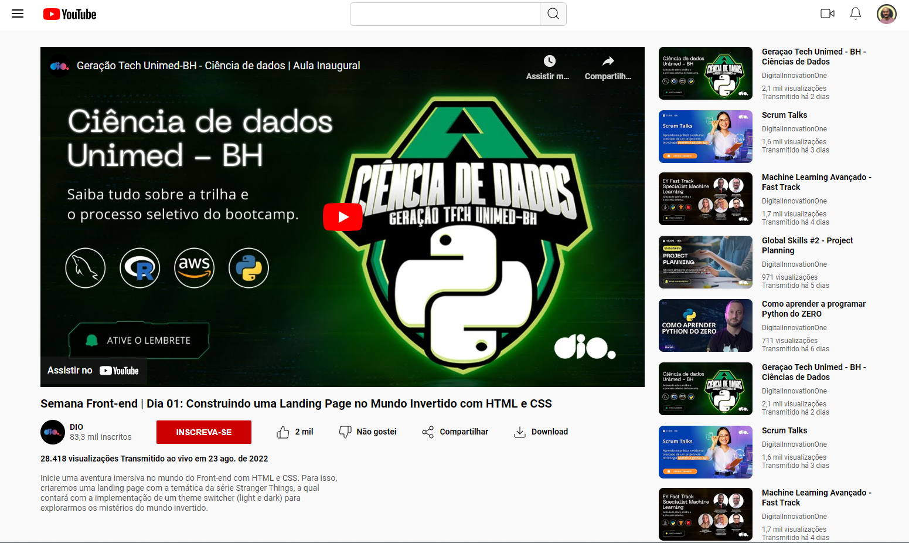

# Desafio CSS - Clonando a Tela do YouTube

Este é um desafio de CSS baseado no curso de Formação CSS Web Developer da DIO.me. O objetivo é clonar a tela principal do YouTube, utilizando os conceitos de display, position e flexbox.

## Desafio

O desafio consiste em clonar a tela principal do YouTube, incluindo os seguintes elementos:

- Cabeçalho com logotipo e caixa de pesquisa.
- Botão hamburguer.
- Seção com vídeo principal e descrição.
- Barra lateral com vídeos recomendados e informações adicionais.

## Conceitos Utilizados

Neste desafio, foram aplicados os seguintes conceitos:

- **Display**: Utilizado para controlar o tipo de layout e fluxo dos elementos na página, como block, inline, inline-block, flex, entre outros.
- **Position**: Utilizado para controlar o posicionamento dos elementos em relação ao fluxo normal do documento. Foram utilizadas as propriedades `position: relative` e `position: absolute` para posicionar alguns elementos.
- **Flexbox**: Utilizado para criar layouts flexíveis e responsivos. A propriedade `display: flex` foi aplicada em elementos pai para organizar seus filhos em linhas ou colunas.

## Resultado

Ao final do desafio, espera-se que você tenha criado um clone visualmente semelhante à tela principal do YouTube, utilizando os conceitos de display, position e flexbox.

## Considerações Finais

Este desafio é uma ótima oportunidade para praticar e aprofundar seus conhecimentos em CSS, além de fortalecer o entendimento sobre os conceitos de display, position e flexbox. Lembre-se de buscar referências, utilizar as ferramentas de desenvolvedor e explorar diferentes abordagens para chegar ao resultado desejado.

